			Ardberry Home Automation App

Introduction

Ardberry Home Automation App is an android app which is used to control devices of Ardberry Technology Pvt. Ltd. remotely with the help of connection between device and smart phone through a Wi-Fi network. You can also take a watch on amazing product gallery of company. Also app is filled with awesome animations and design which gives you a perfect user experience.

List of activities

•	Main Activity
•	Ardberry Technology Pvt. Ltd. Activity
•	Account Activities
•	Control Room Activities
•	Slider Activities

About Activities

1. Main Activity	

•	Slider of pictures using viewFlipper widget and custom animations coded stored in anim resource file.
•	Slider of Quotes using viewflipper widget and custom animations coded stored in anim resource file.
•	Beautiful Gallery with pictures added through online URL with the help of Glide library. Slider between pictures using viewflipper widget and custom animations 	    coded stored in anim resource file. Touch event listener used to detect touches providing a good user experience.
•	Footer containing links of Facebook, Instagram, Twitter, and LinkedIn links associated with company accounts using intent.

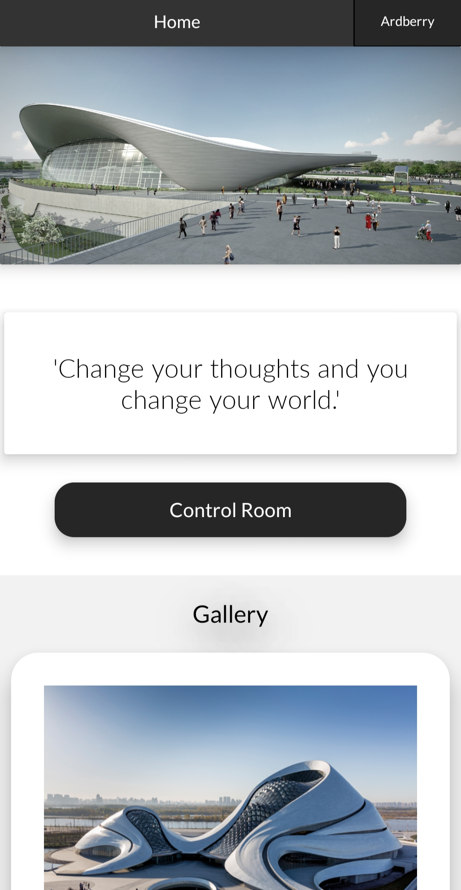&nbsp;&nbsp;&nbsp;&nbsp;&nbsp;&nbsp;&nbsp;&nbsp;&nbsp;&nbsp;&nbsp;&nbsp;&nbsp;&nbsp;&nbsp;&nbsp;&nbsp;
   &nbsp;&nbsp;&nbsp;&nbsp;&nbsp;&nbsp;&nbsp;&nbsp;&nbsp;&nbsp;&nbsp;&nbsp;&nbsp;&nbsp;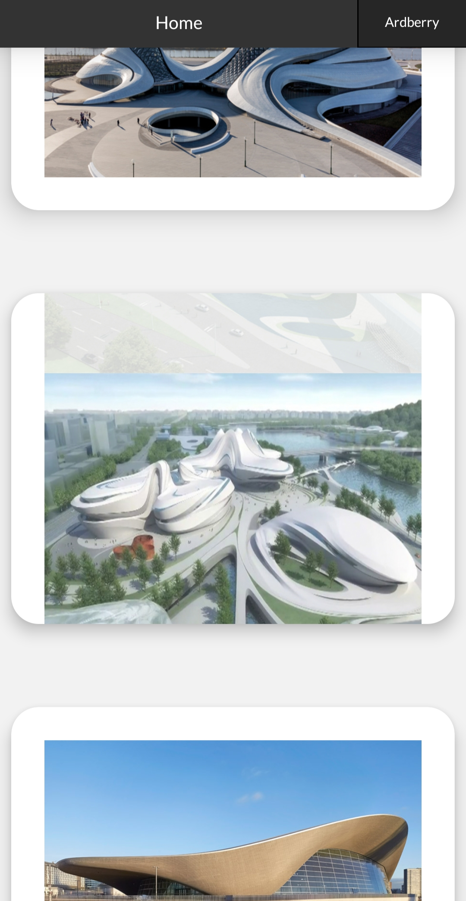

2. Ardberry Technology Pvt. Ltd. Activity

•	Slider of pictures using viewFlipper widget and custom animations coded stored in anim resource file. Pictures are stored in firebase storage of ArdberryT project and received using download links of pictures.
•	About Ardberry Technology Pvt. Ltd. description sliding over slider of primary slider using nested scrollViews.
•	Our Products Gallery with pictures added through online URL with the help of Glide library. Slider between pictures using viewFlipper widget and custom animations coded stored in anim resource file. Touch event listener used to detect touches providing good user experience. Classic black on white theme giving a better user interface.
•	Map added using adding map fragment in xml file and location set on map using map functions in java file with a blue pin on location.
•	Footer containing links of Facebook, Instagram, Twitter, and LinkedIn links associated with company accounts using intent.

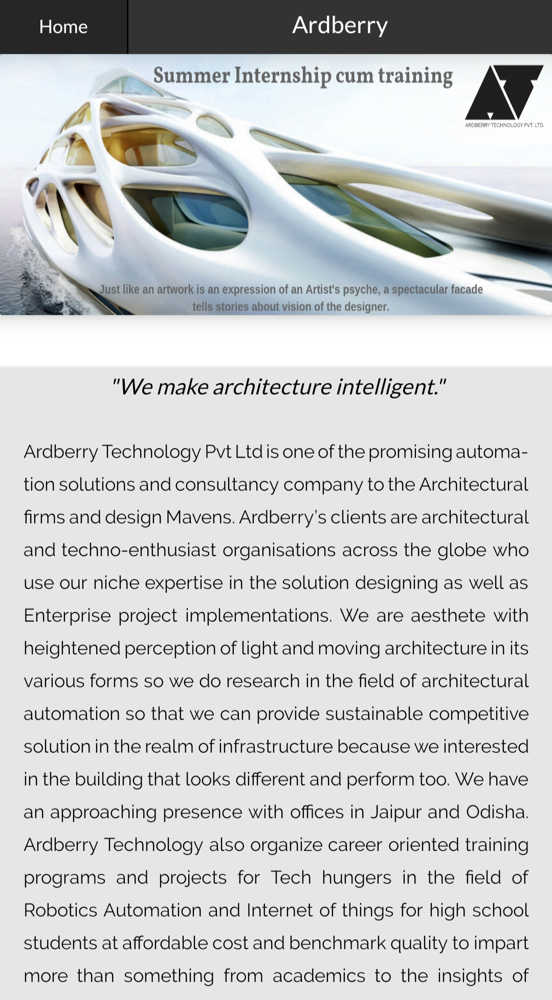&nbsp;&nbsp;&nbsp;&nbsp;&nbsp;&nbsp;&nbsp;&nbsp;&nbsp;&nbsp;&nbsp;&nbsp;&nbsp;&nbsp;&nbsp;&nbsp;&nbsp;
   &nbsp;&nbsp;&nbsp;&nbsp;&nbsp;&nbsp;&nbsp;&nbsp;&nbsp;&nbsp;&nbsp;&nbsp;&nbsp;&nbsp;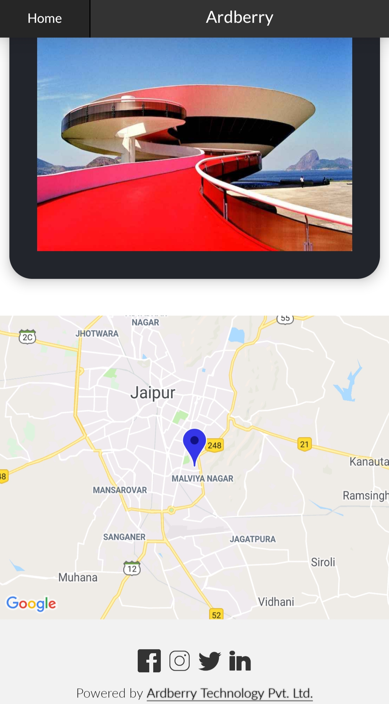
 	 

3. Account Activities

•	Account Activities contains custom made gradient backgrounds stored in drawable resource file.
•	Login Activity uses firebase authentication using email and password.
•	Signup Activity uses firebase authentication using email and password to create account of user for working further through app.
•	Forgot password Activity uses firebase authentication using email and password to send a reset password link which changes user's password in a simple procedure.
•	User cannot proceed to Control Room without login. If user is already logged in, app directly skips the login activities and precedes the user further to control room.
•	Admin can manage accounts anytime in firebase authentication panel.

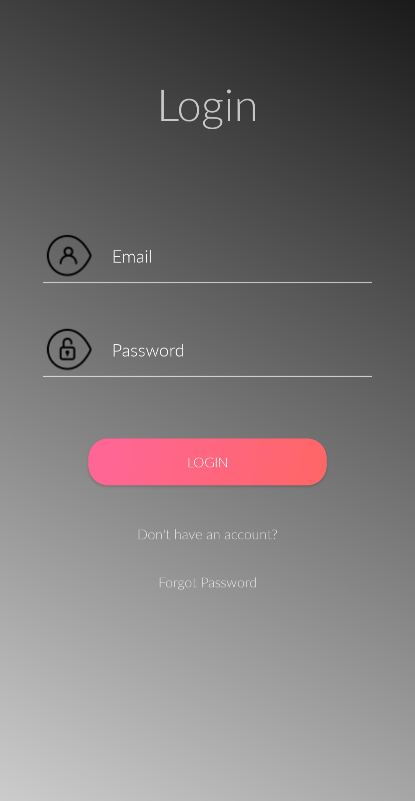&nbsp;&nbsp;&nbsp;&nbsp;&nbsp;&nbsp;&nbsp;&nbsp;&nbsp;&nbsp;
   &nbsp;&nbsp;&nbsp;&nbsp;&nbsp;&nbsp;&nbsp;&nbsp;&nbsp;&nbsp;&nbsp;&nbsp;&nbsp;&nbsp;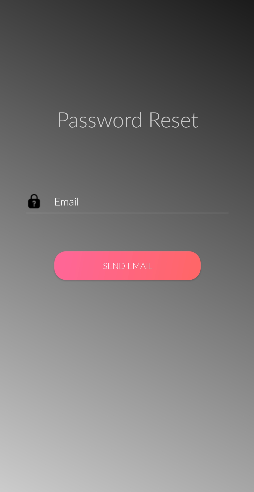
&nbsp;&nbsp;&nbsp;&nbsp;&nbsp;&nbsp;&nbsp;&nbsp;&nbsp;&nbsp;
   &nbsp;&nbsp;&nbsp;&nbsp;&nbsp;&nbsp;&nbsp;&nbsp;&nbsp;&nbsp;&nbsp;&nbsp;&nbsp;&nbsp;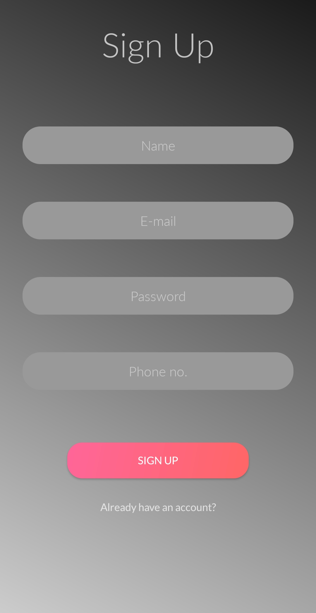
			 
4. Control Room Activities

•	Custom layout on the basis of client's requirement in the Houses activity. Custom Animations stored inside anim resource file. Classic white on black theme giving user a good user interface.
•	Custom layout on the basis of client's requirement in the InsideHouse activity. Custom animations stored inside anim resource file. Colored lights indicating status of device. Fan and Fridge buttons proceeds through vertical and horizontal slider respectively.

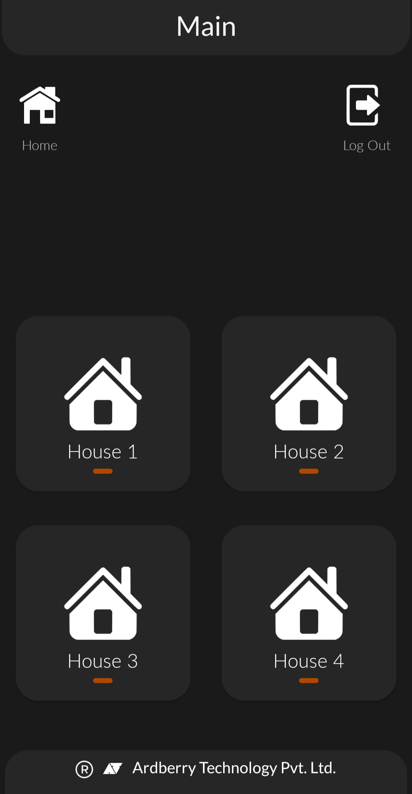&nbsp;&nbsp;&nbsp;&nbsp;&nbsp;&nbsp;&nbsp;&nbsp;&nbsp;&nbsp;
   &nbsp;&nbsp;&nbsp;&nbsp;&nbsp;&nbsp;&nbsp;&nbsp;&nbsp;&nbsp;&nbsp;&nbsp;&nbsp;&nbsp;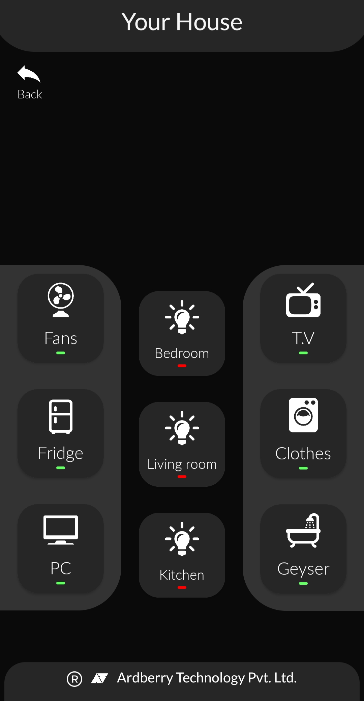
&nbsp;&nbsp;&nbsp;&nbsp;&nbsp;&nbsp;&nbsp;&nbsp;&nbsp;&nbsp;
   &nbsp;&nbsp;&nbsp;&nbsp;&nbsp;&nbsp;&nbsp;&nbsp;&nbsp;&nbsp;&nbsp;&nbsp;&nbsp;&nbsp;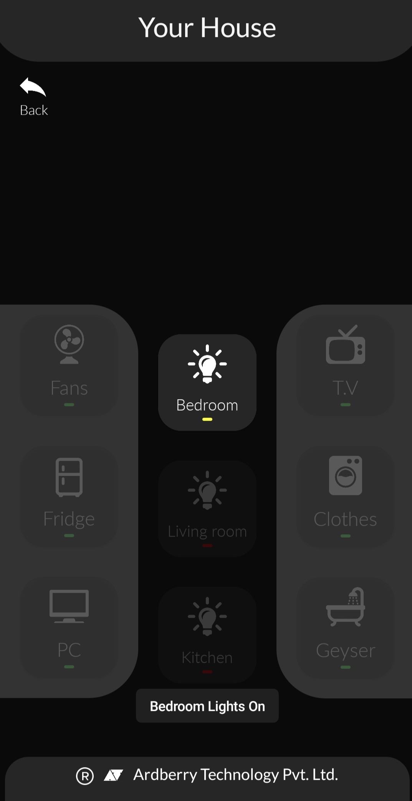
			 
5. Slider Activities

•	InsideButton Activities contains sliders and switch to control the hardware device. Commands to the device are sent through webView URL which are further received by ESP providing specific Wi-Fi. 
•	Sliders give a pause to let the hardware work till the time pause time. Pictures and angles gives precise idea to user of the way the device will look after process.
•	Activities start with the same angle where the user leaves previously. The values are stored in user's mobile app's data using sharedPreferences.

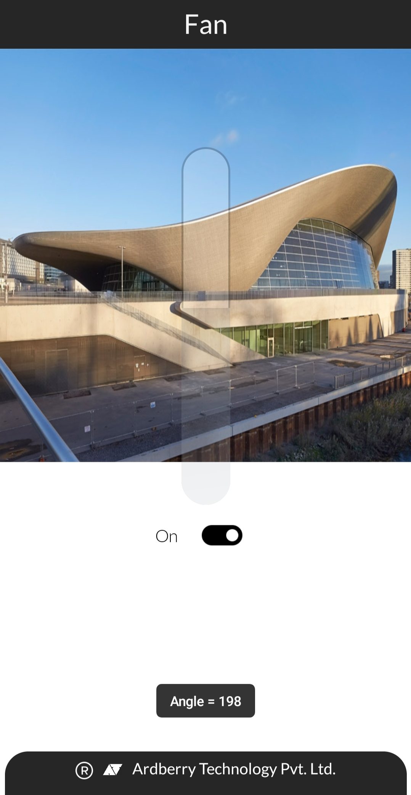&nbsp;&nbsp;&nbsp;&nbsp;&nbsp;&nbsp;&nbsp;&nbsp;&nbsp;&nbsp;&nbsp;&nbsp;&nbsp;&nbsp;&nbsp;&nbsp;&nbsp;
   &nbsp;&nbsp;&nbsp;&nbsp;&nbsp;&nbsp;&nbsp;&nbsp;&nbsp;&nbsp;&nbsp;&nbsp;&nbsp;&nbsp;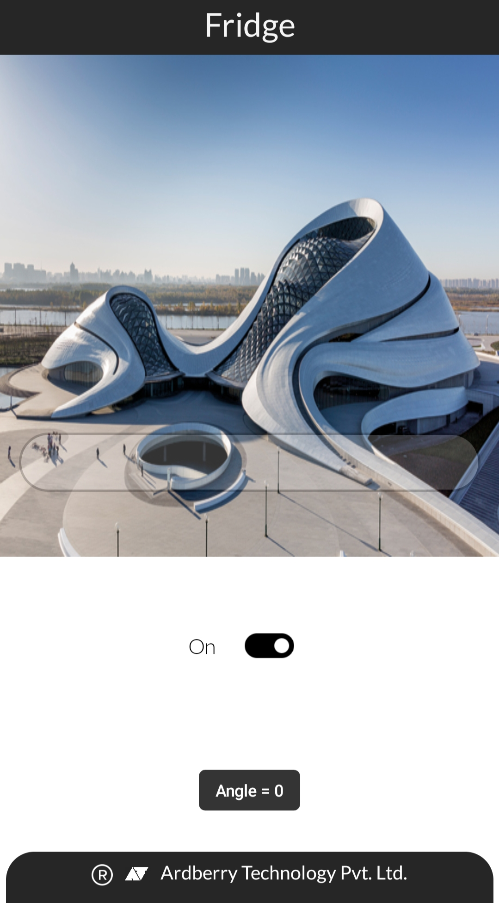
 		 

Problems Faced

•	Learning and implementing animations took lots of time.
•	Touch Listener on sliding thumb up on picture sliders was difficult to implement as animations and touch listener should work together.
•	Creating a perfect URL to command the ESP was difficult as ESP8266 doesn't have much concepts on internet implementing the same.
•	Map fragment's pin was a unique concept to me and took lot of time to implement.
•	Firebase Authentication was a new concept to me and took a lot of time to implement in app.

